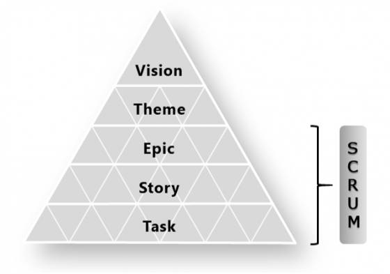

# A pretty good summary of Lean, Agile, Scrum

## Glossary: Lean, Agile, Scrum, Sprint, Kanban

* Agile and Lean are technically different things, but it’s okay to consider them similar — they are both modern versions of trial & error; i.e. experimental & iterative approaches for highly uncertain challenges.
* Lean Manufacturing (Lean TQM) and Lean Startup are technically different things, but it’s okay to consider both as Lean. (More on this [here](https://medium.com/@takeshi.yoshida/lean-lean-manufacturing-lean-startup-clarified-759fd0f9130) .)
* Scrum is one of the most popular Agile implementation frameworks. Sprint is a Scrum terminology. It’s what the iteration cycle in Scrum is called.
* So: **Lean ≈ Agile > Scrum > Sprint**

## Why Lean & Agile?

Because in this changing world of social and digital engagement, we need a better way of doing business and managing organizations.

Lean & Agile are antidotes to the two main causes of dysfunction in modern organizations:

**1** **Waterfall project management**, and

**2** **Functional hierarchical organization structures**.

### Waterfall Project Management vs Agile Product Development

When we think of project management, most of us imagine a disciplined, step-by-step approach of work with good planning and clear goal setting. This is essentially waterfall project management.

Waterfall project management thinking is ingrained in our culture. Our education puts emphasis on good preparation and step-by-step prudence. Progress is meeting the marks on check points. Knowing we are on track gives us comfort and confidence, and it also helps monitoring and management easier for our teachers and leaders. It is a good approach. Many of the modern marvels in the world wouldn’t exist without waterfall. Enterprises across the globe have scaled successfully with waterfall. But waterfall has its limitations: it works well in projects of repetitive nature and relatively low uncertainty.

The reality is that the world is full of uncertainties. Human behavior is hard to predict. And in a project where you are developing a product that you are yet to find a market, waterfall project management is a very expensive way of finding product market fit. There is only a finite number of times you can afford to scrap and rebuild products, and the time it takes to go through another product build iteration in waterfall puts you in a disadvantage against competition.

Agile emerged as a solution against the shortcomings of waterfall. It is a much faster, cost effective and less riskier approach for enterprises to cope with the many uncertainties surrounding its business. And in this rapidly digitally transforming world, it is no longer just the startups that have to cope with disrupting markets. Enterprises of all sizes across industries need a better way of coping with change, and Agile is a solution.

### Traditional vs Agile Organizational Structures

Delegating work is an everyday challenge for leaders and managers. Handover culture between teams create obstacles against pursuing higher level enterprise goals. Agile fundamentally addresses these organizational challenges with a redefined model of teamwork and leadership.

In a traditional organization, the leadership and management team is responsible for decision making — for strategy and problem solving, answers are expected to come from above. This puts a huge risk on leaders “making the right decisions”. Yet again, in this rapidly evolving age of digital and social, it is rare to be right in one go for anyone. Recognizing that problem solving is a discovery process, Agile encourages hypothesis building and experimentation as an all organization exercise. Simply put, more pair of eyes and collective intelligence increases the chance of “getting things right”.

### The Spirit of Lean & Agile

Lean & Agile are approaches, not methodologies. Even Scrum, an implementation framework of Agile, refuses to be called a methodology. That is because there is no one rigid methodology that works for problem solving against all uncertainties. Instead, you follow certain common principles, or what can be summarized as the spirit of Lean & Agile, and heavily adapt:

* **Relentlessly pursue product market fit** (= delivering real value to customers) as a whole organization effort.
* **Build, measure, learn**: accept uncertainty — that’s why we hypothesize, test and validate to see if we are getting closer to what our customer really wants. Until it’s nailed, do it in small increments and keep on iterating.
* It’s everyone’s job to understand the customer, not just sales & marketing or the leadership team. It’s not someone else’s job to think customer — it’s your job, too. So, you are allowed and encouraged to run build-measure-learn experiments with customers (even if you are not directly customer facing), and the leadership team will facilitate, as servant leaders, a systematic collaborative working framework.
* In Lean & Agile, no one gets blamed. If there’s a failure, we don’t seek someone to blame, rather we examine the system that produced the failure and fix it.

## Implementing Scrum

### Vision Hierarchy

First, your enterprise’s vision needs to be shared with everyone in your organization in a “connected” way: everything your people do, all the way down to the task level of individual work, needs to connect back to the vision.

This is harder than one may think. Leadership can tell and sell the vision, but that doesn’t necessarily get everyone’s buy-in. The vision sharing exercise is actually a vision formation exercise with your people.

Enter Scrum: Epic, Story, Task are Scrum terms that help people think of all crucial things in a product development that needs to be built or done to realize the shared vision. By design, Scrum puts everyone on the same page by doing this “Backlog” creation exercise along the vision hierarchy.

### Running Sprints

Scrum is a “time constrained” product development framework comprised of Sprints, where you set a recurring fixed period of work cycle, typically somewhere between one to four weeks, according to the characteristic of your team’s work. (For your knowledge, Kanban, another Agile software development framework, is a “capacity constrained” approach.)

The idea is to do things in small increments and fast iterations, with strong emphasis on reviewing work to help the team move towards the goal. Hypothesis building and repeat experimentation is an integral part of Scrum, as most product development face uncertainties, and discovery is key (marketing is a prime example — product market fit itself is a discovery process).

### 1. Backlog

Think of everything that could possibly be included in the product or needs to be done in the product development. Tread the path of the user journey: User Stories are a great way of contextualizing customer wants and needs.

**User Story: As a \[user], I want \[what], so that \[value].**## 2. Sprint Planning

Prioritize and estimate the Backlog, decide what to do in the coming Sprint.

* For estimation of how long it will take to get each job done, [Planning Poker](https://en.wikipedia.org/wiki/Planning\_poker) is useful.
* The **Kanban Board** (or Scrum Board) is a key item in Scrum. This is where information is persistently displayed, visualized and shared with the team. Customization is encouraged to fit the team’s workflow.
* **Definition of Done** is another must observance in Scrum. Definition of Done is not just a quality assurance notion for fellow Sprint team members to verify work before release. It is also a measuring and learning criteria for the many hypotheses and experimentation that take place in the Sprints.
* There are two facilitator leader roles in Scrum. The first is the **Product Owner**, the “what” guy, and the second is the **Scrum Master**, the “how” guy. The key is facilitation — the Scrum team’s productivity is measured in “**velocity**”, or how fast they can get things done, and it’s most productive to facilitate team members to individually and collectively make decisions on what to do and how to do things, rather than instructing them as in a traditional hierarchical organization.

### 3. Daily Stand Up

**A typical Scrum team should be somewhere between 3 to 9 people**, plus the Product Owner and Scrum Master. Anything larger, the team’s velocity drops so it’s best to split into different Scrum teams.

The key to velocity is rich communication between team members on progress and impediments. A fixed format Daily Stand Up is proven to be highly effective for this purpose: **every day** at the **same time**, for **less than 15 minutes**, the team gathers in front of the Kanban Board, and each team member shares their progress by answering the following three questions:

**+ What work was done yesterday?**

**+ What work is planned for today?**

\*\*+ Any impediments in the way?\*\*Alternatively, the team can also go through in sequence of the Done and To Do items on the Kanban Board. This can be a better format if multiple team members are involved in the work for each Kanban Board item.

The **Daily Stand Up is not a status update meeting** for the manager to find out who is behind schedule or to give job instructions. Status updates only give snap shots — what’s important is to check-in on the flow. The Stand Up is for the team to understand what work has been done and what work remains, so that people can accelerate teamwork. If someone is stuck, fellow team members come in to help. And if necessary, the Scrum Master rejigs work flow to facilitate obstacle removal.

### 4. Sprint Review and Retrospective

At the end of each Sprint, the Scrum Team does two meetings.

The first is the “what” meeting: the Sprint Review to go over what was done in the last Sprint, facilitated by the Product Owner. This meeting often accompanies demos of new releases and other accomplishments, and members from the rest of the organization are welcomed to join.

The second is the “how” meeting: the Sprint Retrospective. This is for the Scrum team members to reflect and discuss the impediments that surfaced during the last Sprint, and even if things are going well, ideas for improvement. The Scrum Owner facilitates this meeting by making sure the focus remains on fixes to the process and not on people blaming.

At the end of both meetings, the team updates the Backlog and plans for the next Sprint.

## Common Pitfalls of Scrum

### **‣** The Spiritless Scrum: Sprints as Mini-Waterfalls

Often, User Stories become mini specification documents. With that, coding or whatever activity gets executed, and then a UAT (user acceptance testing) or other sign-off process takes place. At first glance this doesn’t sound wrong, and a lot of teams fall into this trap.

The problem is, this is just running a mini-project in mini-waterfall style. Analysis, design, coding and testing are done in sequential fashion, possibly across multiple Sprints and most likely as a hand-over process between functions (e.g. BA (business analyst) > developer > QA (quality assurance)).

Lean & Agile is about discovery against uncertainty. In Scrum, the build-measure-learn cycle is designed to occur within Sprints, and team members who work on hypothesizing, MVP (minimum viable product) building and testing need to work as close as possible with each other; i.e. cross-functional teamwork. Work does not have to be sequential — if something is not working or missing the mark, it’s totally okay to make design changes and modifications, or make the conscious decision to pursue a different approach; i.e. tweaking and mini-pivoting. Mini-waterfalls defeat the purpose of iteration and only achieves the small increment benefit of Scrum.

### **‣** Territorial Scrum

Agile is now common place in software development teams. The problem is, in many organizations it’s just the development team that is running Scrum, effectively creating an island within the organization.

The result is a hand-off culture between the development team and the rest of the organization, i.e. to the sales team: “we’ve put together the product as per your specification, now go sell it”.

The key to propagating organization wide Agile is to let people perceive Agile as a wider notion of communication, cooperation and co-creation, and not just a mere project management framework. Ask the question, if we can’t connect well enough among ourselves internally, how can we connect with our customers? This should sprout the persistent customer value creation and product market fit thinking across teams.

In terms of actual implementation of organization wide Agile, Scrum on sales and marketing can be ran in parallel to the development team’s Scrum. Eventually though, it would be best to aim to shifting to cross-functional Scrum teams where development, sales and marketing functions are all within each Scrum team, aligned by products or client projects.

### **‣** Scrum Master in Command

During the Daily Stand Up, if people are giving status updates to the Scrum Master, and the Scrum Master is telling people what to do, then you’re defeating the purpose of Scrum.

Scrum is a systematic effort to get organizations out of manager-worker mode. Commanding leadership models fail in problem solving enterprises — it relies on the leaders to have all the answers, making the leaders themselves the impediment.

In an Agile organization you try to bring out all the “co’s” from people — cooperation, collaboration, coordination, co-creation, communication, connection and so on. The Scrum Master’s role is to keep the “co” flow sideways, not vertical as in being in command.

We also have to understand the passive comfort of the “worker” in manager-worker mode: taking instructions for work is comforting because you don’t have to think of the why’s and how’s, and you are free from the responsibilities of decision making. Scrum addresses the pain of transformation to autonomous working mode in many ways; the small building block approach makes work easier to manage, the Daily Stand Up is meant for team members to help each other when they’re stuck, and the no blaming people culture encourages individuals to take on the risk of experimentation.

### **‣** Sprint Till You Drop

If a leader devises “sprints” as a systematic means of making people work as hard as they can on perpetual high alert, that’s simply a habitual management by crisis, or worse, exploitation of labor.

A less evil leader may position “sprints” as something akin to interval training in track or swimming. He may argue, by going through a continuous cycle of intense work, the team will be able to push the boundaries of its performance. But this risks team members to mental exhaustion. It would be hard to attract and retain talent to work in such high stress environment.

After one Sprint, the next Sprint begins immediately. If the team begins the new Sprint trying to recover from the last one, clearly they are over pacing themselves. Sprints have to be ran at a sustainable pace where no breaks or recovery time between Sprints is needed.

Scrum Sprints probably shouldn’t be called sprints, actually. It should be called more like jogging or something. Yes it’s true that you would want your team’s “velocity” to increase (in Scrum we use “ [Burn Down Charts](https://en.wikipedia.org/wiki/Burn\_down\_chart) ” to measure this), but it’s not terminal velocity that you go after. It is improvement in average velocity that you pursue, i.e. more distance covered in the same amount of time. And as any long distance runner will attest, finding the right pace and rhythm is the key for going the distance.
