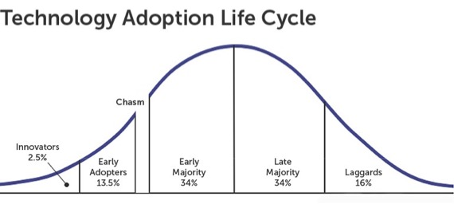

# “Crossing the Chasm” Summary and Review

##

[#quantumtalent/coaching](bear://x-callback-url/open-tag?name=quantumtalent/coaching)

## Book Review

Marketers have traditionally identified different kinds of technology consumers: Innovators, Early Adopters, Early Majority, Late Majority and Laggards. The traditional model assumed that, in the lifespan of a product, the market is first dominated by the innovators, then the early adopters and on down the line. This model implies a level of inevitability in the flow of one category to another.

However, there are gaps in the model large enough to derail the most promising startups as they transition from one category of consumers to the next. The biggest gap is the one between Early Adopters and Early Majority, and in_Crossing the Chasm_, author Geoffrey A. Moore is focused on this gap.

Early Adopters (visionaries) are looking for breakthrough technology, and they are willing to pay well to be first with the new technology. The marketing strategies that win this group, however, won’t work so well for the up-and-coming Early Majority. These are pragmatists and risk averse. Moore argues that breaking into a market is an aggressive act, and he proposes a strategy for moving from one market to the next with success.

Moore has written an interesting and useful book. He builds his thesis logically, laying out his ideas methodically and thoughtfully. He explains his ideas well, using examples that are short and to the point. The prose is readable yet dense with ideas. And there is little here that’s superfluous or uninformative — Moore doesn’t waste his time with details that don’t contribute to the whole.

## Chapter 1

There are two kinds of change:

* Disruptive, or discontinuous, innovation gets us to change our behavior or the products we use.
* Sustaining, or continuous, innovation entails steady improvements and upgrades to products that don’t make us change our behavior.

Within these broad categories, there is a spectrum of innovation, some requiring significant adaptation on our part, some not requiring much of us and some falling between the extremes.

Disruptive change is the price of modernization. Sooner or later it comes to every product; sooner or later all consumers must adapt their behavior. Companies need to learn how to handle disruptive change. High-tech industries happen to have substantial experience managing disruptive change, and companies from other industries can benefit from this experience.

_Technology Adoption Life Cycle_

Source: [http://www.themarketingstudent.com/wp-content/uploads/2017/04/chasm-adoption-lifecycle.jpeg](http://www.themarketingstudent.com/wp-content/uploads/2017/04/chasm-adoption-lifecycle.jpeg)

The kinds of consumers that will buy a product exhibit a range of adaptability to novelty, divided into five categories: Innovators, Early Adopters, Early Majority, Late Majority and Laggards.

* Innovators seek out novel technology; it’s like a hobby for them. There aren’t many Innovators, and because they’ll try new things, they are important. Other people see them use new things and feel braver themselves about trying them.
* Early Adopters are quick to understand the benefits of new technology. Unlike the Innovators, they don’t love technology for its own sake. This group relies on its own intuition and vision to make buying decisions.
* Early Majority are practical minded consumers. If a product seems useful, this group will try it. The Early Majority are cautious of fads.
* Late Majority consumers wait for something to become well established. They don’t feel confident in their ability to deal with technology and often buy from big companies.
* Laggards are those consumers who, for personal and/or economic reasons, are not looking to buy new technology.

Most people fall into the Early and Late Majority categories, but understanding each group is crucial for marketing to them. Each of these groups has its own response to disruption. Each group has its own psychographic profile.

The High Tech Marketing Model uses this Technology Adaptation Life Cycle as a framework. Markets are developed according to the model, starting with Innovators and working down to Laggards. This process turns out to be harder, though, in real life than it is in theory. It isn’t a simple thing to sell to one group and then adjust one’s marketing to sell to the next segment down the line. Some groups are different from each other; the same strategies just won’t work.

There are cracks between each of the segments. The crack between Innovators and Early Marketers, for example, arises when there’s new technology that motivates the Innovators, but not the Early Markets, because there aren’t any practical applications for the technology (and this group doesn’t know what to do with it). The crack between the Early Majority and the Late Majority occurs because members of the former group are willing to learn a little about their technology in order to use it, while the latter won’t put energy into learning. For Late Majority consumers, the technology has to be intuitive and easy to use.

The biggest gap is the one between Early Adopters and Early Majority. This gap is so significant that it isn’t a crack so much as it’s a chasm. Both groups can superficially appear similar — the difference is the expectations of the customer. Early Adopters are looking for a change agent. By adapting early to the change, they hope to beat their competitors. They know that being first with new technology likely means that there will be glitches and problems, but they are comfortable with that. The Early Majority, on the other hand, is looking for productivity improvement. They favor evolution over revolution; they want things to work smoothly.

Because these two groups are so different, the Early Adopters don’t serve as examples and role models for the Early Majority. The Early Majority need a reference, they need to see how the product works for someone like themselves.

## Chapter 2

Picture moving through the stages from Early Adapter, to chasm, to Early Majority: first there is a market, then there is no market, then there is. It’s important to address each stage appropriately and to adjust your marketing to each customer group.

The first customers of high tech products are Innovators and Earlier Adapters (techies and visionaries). Innovators like technology for its own sake. They are nerds. They are willing to overlook all sorts of problems with new technology in order to be on the cutting edge. They demand honesty. They want highly competent tech support. They want to be the first to get the new product, and they want the product cheap.

Because Innovators are an important part of the early market, sometimes it’s worth giving them stuff for free or at discount. Direct response advertising is particularly effective with these folks. Innovators are a useful market group, because they’ll give you early feedback on your product, and they can ignite enthusiasm for your product.

Early Adopters are visionaries. They are highly motivated. They are looking for breakthrough technology — game changers — and they are willing to pay for that technology. They have high expectations and they get disappointed easily.

The way to find visionaries is to let them find you. If you are engaged with techies, they will find you. These customers tend to be the ones who see the possibilities in new products, and so marketing should start with them. It’s important to manage expectations. You need a direct sales force that understands the visionaries. You need to be flexible and accommodate their goals. Understand what their dreams are to market to them. And you must keep the enthusiasm going without making promises you can’t keep.

The real money is to be made, naturally enough, by selling to the Majority. The Early Majority folks are pragmatists. They’re risk averse; they don’t want beta anything. They’re hard to win over, but once you’ve done so, they’re loyal. Standardization is important to many companies for practical and pragmatic reasons. Once your product has been selected for use within an organization, that selection will likely become standardized and purchasing from you will be part of their regular process.

Late Majority consist of about one-third of potential customers for technology. They could be classified as conservative when it comes to change. This group doesn’t like disruptive innovation. They are believers in tradition, not progress. If their technology works for them they see no reason to change it. Although they resist new technology, the Late Majority will adapt eventually, in order to keep in step with the rest of the world. They buy at the end of a cycle, and they like to buy cheap. Unfortunately, because they do buy cheap, they sometimes buy junk, and this reinforces their negative opinion of technology.

Tech companies aren’t generally sympathetic to these consumers, and consequently, their market potential is often neglected. But there is a great deal of benefit to be gained by understanding the Late Majority. Since they want proven technology, there’s opportunity to be had in bundling existing components together and selling them at discount. Conservatives give tech companies a market for technology that’s losing steam otherwise.

Pragmatists drive the development of the mainstream market. You don’t have to be first or best with this market, but you do have to offer a product that’s adequate and sufficiently current. Once technology becomes old, it’s predictable and reliable enough on which to build the next wave of innovation. To appeal to conservatives, offer technology that adds value to existing infrastructure.

The Laggards are skeptical about new technology and sometimes go so far as to block it. There is a tendency to try to neutralize their pull, but we actually could benefit from paying attention to them. Skeptics have been burned by past promises. When new technology becomes available, all sorts of predictions are made that don’t materialize. (Cable TV was supposed to spell the end for commercials.) Skeptics hold onto these failed promises like old grudges. By listening to them, however, we gain some credibility with everyone. We should always be careful about what we promise.

Despite the gaps, these various market segments are willing to use each other for reference, and — chasm notwithstanding — pragmatists can be open to following visionaries.

## Chapter 3

After reaching the potential of the early market, before the pragmatists are willing to take a risk on something new, a company is often endangered by negative cash flow. At the same time, competitors have now had the time to observe the new product and respond with knockoffs. Venture funding may be drying up just about now. Some investors, known as vulture capitalists, prey on companies stuck in the chasm. They do their best to discredit the companies and drive their price down, then swoop in and buy them for cheaper than the value of their assets.

The chasm is fraught with peril. It’s important to get to the mainstream market as quickly as possible. But breaking into a market is an aggressive act. Other companies don’t want you there, and consumers are suspicious of you. Focus on a single point, driving competitors out of the targeted niche market. Then move to adjacent markets. The important thing about this strategy is to start focusing on just one niche. It’s easier to market to a small base — you can work out kinks in the product and experiment with marketing approaches.

Tech execs are wary of marketing to niches, wanting to sell to everyone, everywhere, at all times. They are sales driven, not market driven. But crossing the gap is like starting a fire. You need to have kindling before the big logs will catch. You need the niche market because they are referenceable. You win them over by providing them the whole product — everything they need to achieve their goal. It’s a lot of work; you can’t offer this level of service to the whole world. You make these kinds of commitments strategically, where they’ll do the most good.

Market driven approaches are best. The scattered nature of sales driven approaches virtually guarantees that there will be no benefits from network effects. It is so useful when consumers have contact with each other and talk about your product, recommending it among themselves. That isn’t very likely to happen in the larger market, but it can easily happen in a niche market.

Once you’re secure on your beachhead, you can then move beyond your niche market and expand to adjacent markets. Target those segments strategically.

## Chapter 4

You have to pick a niche — it’s easier to dominate a niche market. Divide the market into segments, analyze each segment (looking at things like size, accessibility to distribution, etc.) and pick one. Sounds easy, but people often have trouble doing it, because it’s scary and there’s little information available on which to base a decision.

If a product is truly innovative, it’s hard to predict how it’ll be received by a market. The visionaries who’ve previously purchased the product are so different from others that it isn’t possible to apply conclusions from their experience to niche markets. And numeric data isn’t going to help here. It can be reassuring to have numbers and forecasts and so forth, but there isn’t enough that’s known about the situation for those numbers to really mean anything.

Look for a target customer characterization: the type of person who can represent the typical customer. If you don’t know what the customers look like, make them up, create as many of them as possible. After a while, you’ll notice a few basic types emerge. As part of the process for selecting the target market segment, develop a library of short, target customer scenarios, detailing a customer’s experience before the product and after the product. And then rate them.

The most important things on which to rate the scenarios include: target customer (there must be real buyers in the category); compelling reason to buy (if it’s not worth it, they won’t buy it); whole product (is the customers’ need satisfied); and competition (others already meeting this need). Of these, perhaps the most important factor is compelling reason to buy.

Other considerations include the following factors:

* Partners and allies: Relationships established that allow us to provide whole product.
* Distribution: A sales channel is in place.
* Pricing: Price should make sense given the context and the target customer’s willingness to pay.
* Positioning: The company should have credibility with the target.
* Next target customer: There should be adjacent niches to acquire once you succeed with this one.

Eliminate low ranking scenarios, continuing to narrow the options until you’re down to one target scenario. Resist temptation to move forward with more than one — you cannot hit two balls with one swing of the bat. Do some market research to validate your decision if you feel more comfortable, but never stop charging ahead.

You may need to make some adjustments to your target, whittling it down if it’s too broad or opening it up if it’s too narrow. It’s important to find a pond of the right size: small, but not claustrophobically so.

## Chapter 5

Your target customer should have a compelling reason to make a purchase. Create a marketplace for your target customer and make sure your product is the best option for them. You want to establish a monopoly in your niche market.

There is a gap between what marketing promises and how well the product fills that promise. All sorts of extra things might be needed before you can use the product (you need to buy batteries, pay for a service, get media, buy headphones, get a storage device… you get the picture).

There are varying levels of product completeness:

* Generic product: What’s shipped in the box.
* Expected product: What the consumer thinks the product is, including all the minimum stuff you need to make the product work.
* Augmented product: The product set up with the best chance to perform like the consumer wanted it to.
* Potential product: The room for growth as more additions and enhancements for the product come on the market.

Consumers on the left end of the Technology Adoption Life Cycle (the visionaries and the techies) are the ones who need whole product support the least. Pragmatic customers, on the other hand, prefer the whole product. They like standardization that enables software to go from one machine to another. If they have to buy things piecemeal, they will — but as soon as there’s a better option, they are all over it. This whole product model is the key to successfully negotiating the chasm between the Early Adopters and the Early Majority. Whole product planning is the key to market dominance.

It’s nice to have a good, generic product, but even that isn’t necessary. It’s all about bundling, so people have the whole product. Figure out the minimum needed for a whole product: think about software, additional hardware, system integration, installation, change management, training and standards. Design the whole product backward, starting with the end user and their expectations of a functioning product.

There’s a lot to say for working with partners. But in the world of marketing, it’s difficult to achieve a good working partnership, due largely to culture clashes between companies. There are some examples of successful partnerships, yes, but they’re the exception rather than the rule. Whole product alliances are much more successful. These alliances can facilitate the whole product by coordinating production schedules and other functions, and they work because they’re in both companies’ best interests. They are tactical alliances. Creating the whole product establishes a value chain.

## Chapter 6

The next step is to get a fix on the competition. We need to understand who they are and how to drive them away from our niche market. If your product is truly innovative, you might not have any competition yet. If that’s the case, you’ll need to create the competition, and this might not come from other products so much as from other ways of doing things.

People resist new things, because they fear change. In the early market, however, visionaries champion change. Their competitors are pragmatists within the company who favor the status quo, and these groups hash it out.

It’s different in the mainstream market — this is the realm of the pragmatist. Competition in this market results from the evaluation and comparison of products and vendors within a product category. The pragmatist is reassured by following a procedure using checklists and ratings systems. Comparing different products is essential; competition is required for the sale to happen. Position your product in a buying category that already has some options, to provide context. But you want to be sure that your product is the best option in the category. (Focus on the needs and wants of the pragmatists.)

The early market is about technology and product; the mainstream decisions are driven by company and market. Crossing the chasm involves transitioning from product based to market based values.

Use two competitors as beacons to create your value proposition. The first competitor, the_market alternative_, is a vendor from whom the customer already buys. The problem this competitor addresses is the same one your product addresses, but through disruptive technology, your product better solves the problem. The other competitor, the_product alternative_, is a technology company that offers a product similar to the one you offer. The point in highlighting this company is to show that there are others doing something similar. This is an idea whose time has come.

If you have trouble identifying companies for either of these roles, this could be a sign that you aren’t yet ready to cross the chasm. Creating the competition is an important part of positioning.

## Chapter 7

Distribution and pricing drive your invasion of the market. Consider each in turn. There are different kinds of technology customers, each associated with an optimal distribution channel._Enterprise executives_purchase large systems to be used across their companies. They are spending a considerable amount of money, and they want responsive sales consultants who will tailor solutions to their needs. The situation calls for relationship marketing: invite senior executives to forums through which they can learn from experts and network with each other. The sales process with this group is very high touch.

_End users_make relatively inexpensive purchases intended to be used individually and locally. They don’t spend much money and are responsive to discounts and promotional pricing. These consumers are largely self-serving. Support is often little more than a website with email.

_Department heads_usually purchase technology to solve problems within their organizations. They need to buy equipment that’s in harmony with their existing systems. Although sales are primarily conducted online, there is considerable personal support. Live chats, invitations to webinars and additional features are typical vendor strategies for these buyers.

_Engineers_make design decisions for products that consumers buy. They don’t usually like salespeople, but they need them. It’s good if they can get as much information as possible themselves online, but eventually they will have to connect to a sales person. It’s good if this group gets a special channel for communicating with the manufacturer’s representatives.

_Small business owners_make inexpensive purchases that are nonetheless important to them. They often purchase from retail outlets. These are usually small proprietors themselves. They can provide considerable advice and support, but they aren’t so good with the sales and marketing.

These different customer types have different compelling reasons to buy. To cross the chasm, entrepreneurs must determine which distribution channel best serves their target customer. After the company has seen success in its target market, the product can be expanded to different channels for additional segments. But for a long time, the first channel will be the main channel.

The most important consideration for pricing at this time is that it motivates the channel. Some guidelines for pricing include the following:

* _Customer Oriented Pricing_: Different types of customers have different price sensitivities. From visionaries, who are willing to pay a lot for cutting edge technology, to conservatives who insist upon paying little for tried and true technology. The important pragmatists in the middle want the reliability of buying from a market leader, and they’re willing to pay a premium for this.
* _Vendor Oriented Pricing_: This kind of pricing is achieved through consideration of cost, with an eye to making a profit off the margin.
* _Distribution Oriented Pricing_requires that price isn’t an issue during the sale. Early Market customers are typically willing to pay more. Crossing the chasm may involve dropping the price, but it must remain high enough to be profitable.

## Conclusion

The chasm is more than just a marketing problem. There are other issues that must be addressed. Before the chasm, a company often makes all sorts of commitments, promises to get ahead. After the chasm, everything has changed, but the company is still entangled in these prior commitments. While the best thing is to avoid making these sorts of commitments, this is admittedly easier said than done.

The needs of a post-chasm organization are different from those of a pre-chasm organization. Before the chasm, a company’s goal is to reduce investor risk and grow the company. After the chasm, the goal is to make money.

A company must change and reshape itself after the chasm, because everything will be different. Although a company necessarily shifts its work to satisfy the needs of the pragmatist, however, it’s important to maintain a consistent management style. Just about everything else is subject to reevaluation and change. Not every company can successfully negotiate the transition.

Venture capitalists love the classic hockey stick curve, depicting a gentle rise in revenue until the product takes off and the revenue curve turns sharply upward. But the hockey stick is a flawed model. In reality, revenue is more likely to look like a staircase than a hockey stick — it rises rapidly and then plateaus, then the pattern repeats. Companies that bet the farm on the hockey stick model are sometimes ravaged by vulture capitalists.

Crossing the chasm should be part of every startup’s business plan. Companies should aim to be profitable as early as possible. If profit is important from the beginning, then the discipline will be institutionalized.

Once established, it’s hard to change company culture. As the company’s customers move from visionary to pragmatist, however, so too does company culture. Some within the company will have trouble making this transition. People must go from being “pioneers” to “settlers,” and pioneers often have a hard time settling down. Create temporary roles in the organization to shepherd the company across the chasm. The target market segment manager works to break onto the beachhead; the whole product manager handles product debugging.

Compensation can also become a complex issue. Pioneers and settlers make different sorts of contributions to an organization. Sales relationships that have been cultivated for years need to be compensated appropriately. Developers, too, need to be well compensated — often they are offered equity, yet like any of us, they’d really prefer actual money.

Not surprisingly, there are other issues with which a company crossing the chasm will struggle. Perhaps the most important, however, is simply acknowledging that rapid mainstream market growth does not always, as was thought, flow seamlessly from early market success. It’s necessary to cross the chasm.
