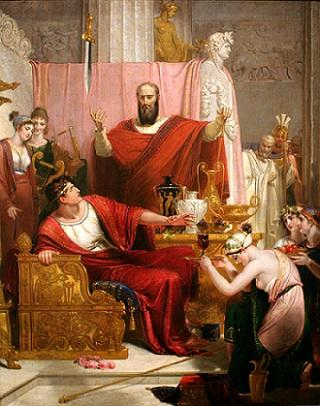

# Espada de Damocles: historia, significado, moraleja

_Cuadro de 1812 de Richard Westall que representa la leyenda de la espada de Damocles._

La **espada de Damocles** es una metáfora utilizada comúnmente para referirse a un peligro inminente y cercano al que se tienen que enfrentar todas aquellas personas que tengan una posición de poder. La expresión viene de una leyenda que supuestamente contaba el filósofo romano Cicerón. Trataba sobre Damocles, un cortesano del rey Dionisio I, que gobernó en Siracusa en el siglo IV a. C.

Desde hace varios siglos, se viene utilizando la expresión «estar bajo la espada de Damocles» para simbolizar la fragilidad de las posiciones de poder. Otras personas utilizan esta expresión en el sentido de que la felicidad siempre es pasajera.

Incluso, algunos estudiosos creen que el significado que Cicerón atribuía a esta frase era que la vida es muy corta y la muerte siempre nos está acechando. Esta metáfora, entonces, serviría para recordar a las personas que deben tratar de disfrutar el momento presente a pesar de lo que suceda a su alrededor.

### Historia de la espada de Damocles

Según contaba Cicerón, Damocles era un cortesano en el reinado del tirano Dionisio I. La leyenda dice que Damocles trataba de conseguir el favor del rey adulándole constantemente, pero en el fondo sentía envidia de su riqueza y su poder.

Sin embargo, Dionisio tenía fama de cruel y de tirano, por lo que la mayoría de sus súbditos le odiaban secretamente. Damocles, que se centraba tan solo en los lujos de los que estaba rodeado el rey, no podía ver los peligros que su posición traía consigo.

Un día, Damocles, corroído por la envidia, habló con Dioniosio y le dijo:

* «¡Debes estar muy feliz! Tienes todo lo que un hombre puede desear: fama, dinero, admiradores…»

El rey, cansado de la adulación constante de su súbdito, le propuso cambiar sus puestos. Durante un día entero, Damocles podría vivir como él, reinando y disfrutando de todos los lujos que podía ofrecer el palacio. Damocles, que pensaba que la riqueza del rey le haría feliz, aceptó sin dudarlo.

Al día siguiente, Damocles llegó al palacio, donde todos los sirvientes se desvivieron por cumplir cada uno de sus deseos. Le sentaron en un trono en la sala de banquetes, donde se pasó todo el día rodeado de la mejor música, platos exquisitos y exóticos, mujeres bailando para él, los mejores entretenimientos…

Damocles se sentía el hombre más feliz del mundo; no se le ocurría nada que pudiera enturbiar su alegría en ese momento. Sin embargo, cuando alzó los ojos hacia el techo, vio algo que le intranquilizó.

Sobre su cabeza colgaba una espada muy afilada, con la punta prácticamente rozándole. Estaba suspendida de una sola crin de caballo, con lo que en cualquier momento podría romperse y acabar con su vida.

Desde el momento en que vio la espada, Damocles fue incapaz de disfrutar de los placeres que le ofrecía el palacio. Dionisio, que había estado observándole todo el tiempo, le preguntó cuál era el problema. Damocles, sorprendido, le señaló la el peligro que colgaba sobre su cabeza.

«Sí», dijo el tirano, «sé que hay una espada amenazando tu vida. Pero, ¿por qué debería eso preocuparte? Yo estoy siempre expuesto a peligros que podrían hacerme perder la vida en cualquier momento.»

En ese momento, Damocles se dio cuenta de su error, y le pidió al rey que le dejara marcharse. A partir de ese día, fue consciente de que la riqueza y el poder tenían también una parte negativa; y nunca más volvió a desear el dinero, la fama o la posición del rey.
