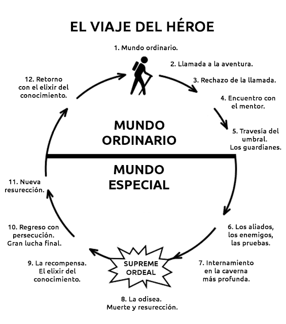

# Las doce etapas del viaje del héroe. Joseph Campbell, Christopher Vogler

##

[#quantumtalent/coaching](bear://x-callback-url/open-tag?name=quantumtalent/coaching)

**Las doce etapas del viaje del héroe**

Joseph Campbell, Christopher Vogler

Tanto en las historias clásicas, épicas o no, como en el guión cinematográfico, el modelo conocido como “El viaje del héroe” satisface una estructura eficiente de narración. Permite armar un planteamiento teórico que calza a la perfección con la  más convencional que divide la historia  en 3 actos: inicio o presentación, nudo o desarrollo del conflicto y desenlace o resolución.

La gran mayoría de las historias contienen en su interior un héroe a la espera de una llamada. El héroe acude a la aventura e inicia su viaje. Durante el mismo supera una serie de retos y desafíos en el que aprende valiosas lecciones. Finalmente, regresa al lugar de inicio transformado, habiendo ascendido en su interior a lo largo de una espiral de crecimiento.

El mitógrafo Joseph Campbell recogió su propia interpretación de este recorrido en su libro “El héroe de las mil caras”, en el que describe este patrón narrativo común a tantos mitos culturales. Este patrón se resume en la tríada: separación, iniciación y retorno.

Años después del estreno de La guerra de las galaxias, un guionista y analista de guiones llamado Christopher Vogler, que trabajaba en la productora Disney, decidió analizar en detalle las ideas de Campbell:

“Las historias del héroe siempre implican una suerte de viaje. Un héroe abandona su entorno cómodo y cotidiano para embarcarse en una empresa que habrá de conducirlo a través de un mundo extraño y plagado de desafíos. Puede ser un viaje real (con un cambio de espacio) o un viaje interior que ocurre en su mente, corazón y espíritu. El héroe crece y sufre cambios, viaja de una manera de ser a la siguiente: de la desesperación a la esperanza, de la debilidad a la fortaleza, de la locura a la sabiduría, del amor al odio… Son estos periplos emocionales los que atrapan al público y consiguen que una historia merezca ser apreciada”.

“Redacté un informe de siete páginas llamado Guía práctica de «El poder del mito» \[el libro que Campbell escribió tras La guerra de las galaxias]; en el describía la idea del viaje del héroe por medio del análisis de algunos ejemplos de películas tanto de reciente estreno como clásicas.”

El informe circuló por la factoría Disney y fue aplicado en varias películas de éxito:

“El modelo del viaje del héroe siguió durante mucho tiempo prestándome un gran servicio. Me sirvió para leer y evaluar más de diez mil guiones para media docena de estudios… Me guió hacia un nuevo cargo en la Disney, de tal manera que fui nombrado consultor para la división de animación en la época en que se gestaron La Sirenita y La Bella y la Bestia.”

Vogler publicó tiempo después su interpretación de las ideas de Campbell en El viaje del escritor. En este libro, Vogler ofrece un esquema del llamado viaje del héroe, que, en su opinión, se puede aplicar a cualquier narración. Para probarlo, analiza películas tan dispares como Titanic, Pulp Fiction, El rey león, Full Monty y, por supuesto, La guerra de las galaxias..

“’El Viaje del Héroe’ no sólo se resume a historias épicas y fantásticas, aplica a todos los géneros. Tiene verdades universales que seguimos buscando para ser mejores personas, entender nuestro lugar en el universo y encontrar un sentido de trascendencia”, precisó.

Es un modelo analítico bien interesante y, aunque es bastante útil, no debe considerarse una camisa de fuerza. Escuelas de autoayuda, de mercadeo y de la búsqueda de crecimiento interior, también lo han utilizado como marco teórico.

Veamos sus características:

**Las doce etapas del viaje del héroe**

**ACTO I (Inicio)**

**1.**     **El mundo ordinario:** El héroe comienza en su vida cotidiana en su mundo conocido. Todo le resulta familiar y estable. Se siente cómodo. Concibe la vida de una manera determinada. En esta fase la audiencia conoce al héroe, descubre sus ambiciones y limitaciones, y forma un lazo de identificación y reconocimiento. Es el mundo normal del héroe antes de que la historia comience.

**2.**     **La llamada de la aventura**: En un momento dado, al héroe se le presenta un problema, un desafío o aventura, y es entonces cuando debe decidir si responde a la llamada o no. El héroe es desafiado a llevar a cabo una búsqueda que cambia su rutina.

**3.**     **Reticencia del héroe o rechazo de la llamada**: Por miedo al cambio o a lo desconocido, o por apego a lo conocido, el héroe rechaza la llamada. Prefiere seguir en su mundo cotidiano, en la comodidad y en la familiaridad. Aquí  el héroe duda o expresa temor. Teme perder   su estabilidad.

**4.**     \*\*Encuentro con el mentor o la ayuda sobrenatural:\*\*El héroe encuentra alguien o algo que le lleva a aceptar finalmente la llamada. Recibe más información sobre la aventura o realiza algún importante aprendizaje que le anima a responder al desafío. Con este encuentro,  el héroe hace contacto con una fuente de apoyo, experiencia o sabiduría. Puede ser una persona  o ayuda sobrenatural. Gracias a su apoyo, el héroe gana seguridad y convicción, lo que lo hace aceptar el llamado y se informa y entrena para su aventura o desafío.

**ACTO II (Nudo)**

**5.**     **El Cruce del primer umbral**: A través del primer umbral, el héroe abandona su mundo ordinario para entrar en un mundo diferente, especial o mágico. Se adentra en lo desconocido y deja atrás lo familiar. Este es el punto en el que la persona en verdad se compromete con el campo de la aventura, dejando los límites conocidos de su mundo y aventurándose hacia el reino desconocido y peligroso, donde las reglas y los límites no están aún bien definidos.

**6.**     **Pruebas, aliados y adversarios:** Mientras recorre su camino, el héroe se enfrenta a una serie de pruebas, encuentra aliados en su aventura y se topa con sus adversarios. Mientras lo hace, aprende las reglas de ese nuevo mundo. Estas situaciones y personas ayudan al héroe a descubrir lo que es especial sobre la aventura que ha emprendido

**7.**     **Acercamiento** **a la Cueva Profunda:** El héroe avanza en el camino cosechando sus primeros éxitos. Supera las pruebas que se le van presentando, hace nuevos aprendizajes y establece nuevas creencias. Esta es la fase en la que e l héroe se prepara para la batalla central de la confrontación con las fuerzas de fracaso, la derrota o la muerte. El héroe tiene éxitos durante las pruebas.

**8.**     **Prueba difícil o traumática (La Odisea o el calvario)**: El héroe se enfrenta a su primera crisis en una prueba a vida o muerte. Es la prueba más difícil, la crisis central de la historia en la que el héroe enfrenta su o sus temores más grandes y prueba la muerte, ya sea literal o metafóricamente. Es la crisis más grande de la aventura, pues lo enfrenta a una opción de vida o muerte.

**ACTO III (Desenlace)**

**9.**     \*\*Recompensa (Apoderarse de la espada o del cáliz):\*\*Tras su encuentro con la muerte, el héroe se sobrepone a sus miedos y obtiene a cambio una recompensa. Es el momento en el cual el héroe disfruta los primeros beneficios de haber confrontado el miedo y la muerte. ¿Qué conoce o experimenta esta persona ahora que está más allá del bien y del mal, de lo masculino y femenino, de la vida y la muerte? Esto es por lo que el héroe inició su viaje. Todos los pasos previos sirven para preparar y purificar para este paso, ya que en muchos mitos la recompensa es algo trascendente como el elixir o la vida misma. Un regalo o bendición es dado al héroe basado en sus habilidades y conciencia.

**10.**     **camino de vuelta:** Superada la gran prueba y ya con el botín, el héroe emprende el camino de regreso al que fue su mundo ordinario. Aquí es donde el héroe se compromete, ya sea voluntariamente o no, a finalizar la aventura y deja (o es echado de) el “Mundo Especial”. Alguna s veces el héroe no quiere volver a su existencia previa y deber ser convencido de hacerlo. Algunas veces el héroe debe escapar con la recompensa, si es algo que los Dioses han estado guardando celosamente. Volver del Viaje puede ser tan lleno de aventura y peligroso como fue ir en él. Así como el héroe puede necesitar guías y asistentes para emprender la aventura, muchas veces debe tener guía poderosos y rescatadores para traerlo de vuelta a la vida de todos los días, especialmente si la persona está herida o debilitada por le experiencia. O quizá el héroe no se da cuenta de que es tiempo de regresar, que puede regresar, o que otros necesitan la recompensa que el héroe ha descubierto. La mayoría de las veces el héroe debe volver al mundo ordinario.

**11.**      \*\*Resurrección del héroe:\*\*El héroe se enfrenta de nuevo a una segunda prueba a vida o muerte en la que debe utilizar todos los recursos y aprendizajes que recogió por el camino. Cuando el héroe enfrenta el desafío que lo purifica, lo redime y transforma en el Umbral A Casa. Para un héroe humano, contrariamente a los héroes trascendentales como Jesús o Buddha, puede significar alcanzar un balance entre lo material y lo espiritual. La persona se vuelve competente y cómoda con ambos mundos, el interior y el exterior. Es  otra prueba donde el héroe enfrenta la muerte y debe usar todo lo aprendido.

**12.**       **Regreso con el elixir**: El héroe regresa a casa con la recompensa y la utiliza para ayudar a todos en su mundo ordinario, que ahora se ha transformado como resultado de su propia transformación durante el viaje y comparte lo que ha ganado en su búsqueda, lo que beneficia a amigos, familiares, a la comunidad y a su mundo.

Tomado con modificaciones de:

Ahora, para poner en contexto práctico, acudimos al libro ESTRATEGIAS DE GUIÓN CINEMATOGRAFICO, del académico español  Antonio Sánchez-Escalonilla , en el cual pone ejemplos de este diseño teórico, con 3 películas bien reconocidas:

“Christopher Vogler enumera doce etapas en el viaje del héroe. No los considera un manual de instrucciones ni una guía estricta, sino como un camino antiquísimo, flexible y duradero a la hora de construir y contar historias. Una premisa narrativa, en definitiva. Apliquemos los pasos de Vogler a tres relatos de forja de héroe en épocas, géneros y ambientes distintos: La guerra de las galaxias, Los Intocables de Elliot Ness y El Señor de los Anillos.

1.**El mundo ordinario**, donde se encuentra el protagonista en su existencia cotidiana, nada exótica.

— Luke Skywalker, aburrido en la granja que sus tíos explotan en el planeta Tatooine.

— Elliot Ness, antes de enfrentarse al mundo de Capone.

— Frodo Bolsón vive feliz en la Comarca.

1. **La llamada a la aventura**, un reto que rompe la monotonía y sitúa al futuro héroe ante los riesgos de su empresa. Es el arranque del guion, el inicio de la aventura.

— El mensaje holográfico que la Princesa Leia envía a través de R2D2.

— La noticia que Ness lee en el diario sobre la niña que muere en la explosión de una taberna de Chicago.

— La misión que Gandalf propone a Frodo para salvar la Tierra Media de Sauron.

1. **El héroe indeciso.** El protagonista percibe el peligro de lo desconocido antes de embarcarse en la aventura (Luke duda ante Obi Wan) o bien en el transcurso de las peripecias (Ness discute los métodos de Malone antes de aceptar su ayuda; Frodo sucumbe moralmente bajo el peso de su misión y es ayudado por Sam).
2. **El sabio anciano**. Es el mentor del héroe, un instructor que ya conoce el camino y que alienta al protagonista. Le ayuda con su experiencia y con sus métodos pero, llegada la hora final, no puede sustituir a su discípulo.

— Obi Wan Kenobi, maestro de jedis, en La guerra de las galaxias.

— Malone, veterano policía, en Los Intocables.

— Gandalf, el mago, en El Señor de los Anillos.

5.**Dentro del mundo especial, o primer umbral.** El héroe acepta el reto y se aventura en el ambiente extraño y peligroso. El compromiso es definitivo. No hay marcha atrás. En ocasiones, el umbral es físico: una puerta.

— Muertos sus tíos a causa del Imperio, Luke se entrega en manos de Obi Wan. Ness acepta los métodos de Malone ante la puerta de un negocio ilegal de Capone; segundos después, los Intocables realizan su primera redada con éxito, aunque Malone ha puesto a Ness ante un dilema: atravesar la puerta a un mundo difícil sin posibilidad de retorno, o evitar el peligro para siempre.

— Frodo abandona la Comarca de los hobbits a través de una cancela subterránea.

1. **Peligros, amigos y enemigos.** Surgen necesariamente a medida que el héroe se adentra en el mundo especial. A un tiempo, recoge la información que necesita para llevar a cabo su misión.

— Ben Kenobi y Luke conocen a Han Solo en la taberna galáctica, pero también comienzan los problemas y sufren la primera persecución del Imperio.

— Ness afianza el grupo de Intocables y se prepara para enfrentarse a Capone.

— Frodo llega a la taberna de Bree, donde todo el mundo le parece sospechoso. También encuentra a Trancos (Aragorn).

1. **La gruta abismal, o segundo umbral.** El héroe penetra en un recinto peligroso, el corazón del mundo especial, para encontrar un objeto relacionado con la misión. Este lugar casi siempre se encuentra en las profundidades.

— Luke entra en la Estrella de la Muerte.

— Un intocable y el testigo de Ness descienden en un ascensor. Nitti se encuentra allí.

— Frodo llega al país siniestro de Mordor.

1. \*\*La prueba suprema.\*\*Es la continuación del estadio anterior. Llegado a la gruta abismal, el héroe se enfrenta a su pesadilla más temida y sufre una experiencia de muerte. Es un descenso del héroe a los infiernos.

— Luke desaparece bajo las aguas fétidas del triturador de basuras.

— Ness encuentra en el ascensor los cadáveres de Wallace y del testigo, bajo la palabra «tocables» escrita con sangre.

— Frodo sufre la picadura mortal de Ella-Laraña en su antro de Mordor.

1. **La espada**. Con este nombre se denomina el objeto preciado que el héroe consigue en la gruta abismal, una vez superada la prueba de muerte. Puede tratarse de un tesoro, un elixir o una persona de especial importancia para la misión. En ocasiones, el trofeo solo consiste en sabiduría para la victoria.

— Luke rescata a la Princesa Leia de las garras de Darth Vader y se lleva los planos de la Estrella de la Muerte.

— Elliot Ness se deshace de los mafiosos en la estación de Chicago, captura al segundo testigo y lo lleva al juicio contra Capone.

— Frodo consigue llevar el Anillo al Monte del Destino.}

1. **El camino de vuelta o tercer umbral**. El héroe está a punto de saborear el éxito de su misión, pero todavía no ha salido del mundo hostil. Se desatan las fuerzas del mal contra él, dispuestas a arrebatarle el trofeo y a no dejarle escapar con vida. En los guiones de aventuras suele propiciar secuencias de persecución.

— Luke, Han y Leia escapan de la Estrella de la Muerte pero son perseguidos por Darth Vader, que ha colocado una señal de posición en el Halcón Milenario.

— Durante el juicio, Ness persigue por las azoteas a Frank Nitti (el asesino de Malone).

— Arrojado el Anillo, Frodo y Sam intentan huir, pero el volcán entra en erupción.

1. **La resurrección, o cuarto umbral**. El héroe vuelve a enfrentarse a la muerte para renacer en una última prueba, antes de regresar a su hogar con la misión cumplida. Las tinieblas lanzan su última ofensiva antes de sucumbir definitivamente. Coincide con el clímax del guion. La conversión del protagonista en héroe llega a su plenitud.

— Luke vuela a lo largo de la trinchera de la Estrella de la Muerte, perseguido por Vader. Se salva in extremis gracias a Solo y destruye la estación espacial.

— Ness consigue que el juez cambie por otro el jurado comprado de Capone, lo cual garantiza el triunfo total.

— Frodo y Sam son rescatados por las águilas.

1. **Regreso con el elixir.** El protagonista vuelve a su mundo convertido en héroe y regresa con algún elixir o tesoro vitales para su comunidad. A veces se trata de una enseñanza, de sabiduría o de la libertad de los suyos. Los protagonistas no vuelven a ser los mismos.

— Luke destruye la amenaza de Vader contra la rebelión y es condecorado.

— Capone es condenado a ocho años de cárcel y Ness se marcha de la ciudad, pero nunca olvidará la aventura ni las enseñanzas de Malone.

— Frodo regresa a la Comarca tras destruir el poder del Señor Oscuro.

Como trama maestra, el viaje del héroe no solo orienta al guionista en el desarrollo de nuevas tramas. Esta premisa dramática también marca la pauta de subtramas, habitualmente relaciones entre maestro y discípulo gracias a la figura del sabio anciano y a su importancia en la forja del héroe protagonista. No obstante, la relación de aprendizaje podría reemplazarse por otra de amistad o de amor: todo depende del criterio que utilice el constructor de la historia para tratar el tema como mejor le convenga. En los tres ejemplos propuestos, la subtrama más importante sigue el patrón maestro-discípulo (Luke-Obi Wan, Ness-Malone, Frodo-Gandalf).

El viaje del héroe también supone un cambio en la historia interior del personaje, que necesariamente repercute en su arco de transformación. Aquí intervienen tanto las enseñanzas del maestro como la vivencia de la propia aventura, a través de los cuatro umbrales descritos por Vogler. Las historias interiores de los tres héroes propuestos podrían resumirse así:

Luke Skywalker. Al principio no es más que un granjero tímido, un muchacho que satisfará sus aspiraciones heroicas arriesgando su propia vida por la Rebelión. La clave de su proceso consiste en la aceptación de los caminos de la Fuerza, revelados por Obi Wan, y en la confianza en sus propias intuiciones, por encima de la experiencia y de la sola prudencia racional.

Elliot Ness. En el punto de partida de Los Intocables, Ness es un agente del Tesoro que desea acabar con Capone utilizando métodos exclusivamente legales. Malone le acusa de ingenuo y le enseñará a emplear los «eficaces» métodos de Chicago, ajenos a la ley. Ness renuncia a sus principios y vence.

Frodo Bolsón. Las penalidades del camino a Mordor y el peso del Anillo maligno transformarán a este joven y alegre hobbit en un protagonista maduro, tocado por las sombras de la muerte. Frodo aprende que el sacrificio del héroe siempre acarrea dolor.

Al término del viaje, cuando la aventura ha concluido, el héroe regresa al hogar de donde partió. Ya es otro personaje, la lucha le ha transformado. Puede que se convierta en leyenda, pero sabe que no debe apropiarse del bien que ha conseguido para otros. Ni siquiera para su propia fama, pues la divisa del héroe consiste en proteger y servir. Dejemos que sea el propio Frodo Bolsón quien nos lo recuerde una vez más, tras su victoria sobre Sauron:

«—Pero —dijo Sam, mientras los ojos se le llenaban de lágrimas— yo creía que también usted iba a disfrutar en la Comarca, años y años, después de todo lo que ha hecho.

»—También yo lo creía, en un tiempo. Pero he sufrido heridas demasiado profundas, Sam. Intenté salvar la Comarca, y la he salvado; pero no para mí. Así suele ocurrir, Sam, cuando las cosas están en peligro: alguien tiene que renunciar a ellas, perderlas, para que otros las conserven».

Aquí, el cuadro original de Campbell, que resume todos los momentos

