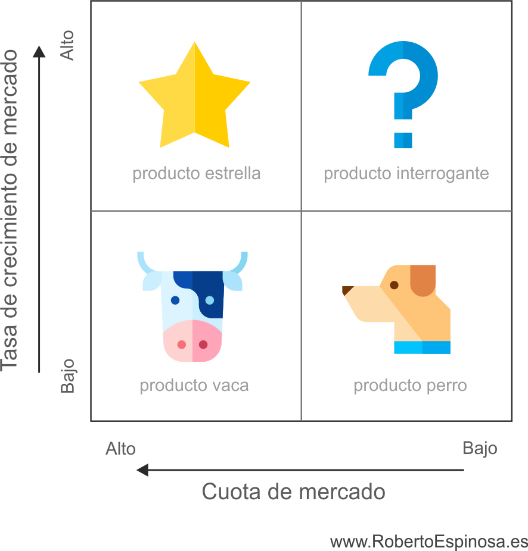
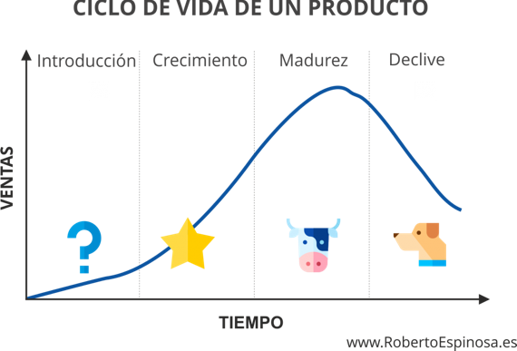
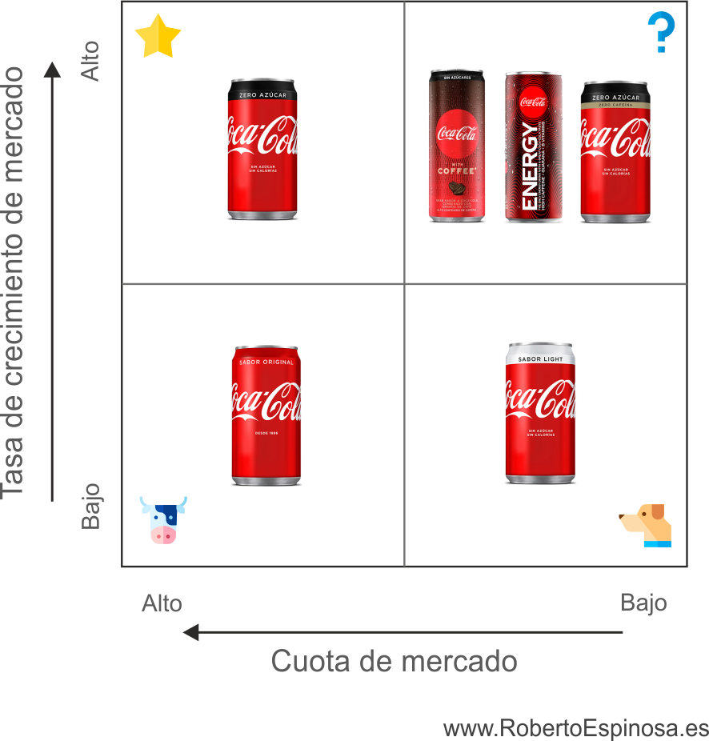

# Matriz BCG: qué es y cómo aplicarla + EJEMPLO

##

[#quantumtalent/estrategy](bear://x-callback-url/open-tag?name=quantumtalent/estrategy)

A la hora de lanzar un producto, es importante encontrar la estrategia correcta que nos ayude a determinar la mejor proyección de éste. En el mundo empresarial no es solo importante la posición actual de nuestros productos, sino también analizar cómo van a evolucionar y que vamos a esperar de ellos en el futuro.

La matriz BCG fue desarrollada por la consultora [Boston Consulting Group](https://www.bcg.com) y publicada por su presidente Bruce D. Henderson en 1973. Es uno de los instrumentos más conocidos en el mundo de la empresa para analizar estratégicamente la cartera de productos y las unidades estratégicas de negocio (UEN) de una compañía.

### ¿Qué es la Matriz BCG y para qué sirve?

La Matriz BCG o matriz crecimiento – participación es una herramienta esencial de marketing estratégico para las empresas.  Esta matriz ayuda a las empresas a analizar su cartera de productos para proponer la estrategia más recomendable a llevar a cabo.

La matriz está compuesta por dos ejes. El eje vertical representa la tasa de crecimiento del mercado _(demanda de un producto en un mercado)_, el eje horizontal representa la cuota de mercado _(ventas de nuestro producto_ ventas totales del producto en el mercado)./

Es una matriz muy sencilla para la toma de decisiones, está compuesta por un cuadrante de 2×2, y dependiendo la situación de cada uno de ellos propone la estrategia más recomendable a llevar a cabo.

Esta matriz te permite realizar un análisis interno para darnos las indicaciones pertinentes para que la empresa pueda decidir en qué productos es más rentable invertir sus recursos y en cuales ha de retirarlos.

### ¿Cuáles son los componentes de la matriz BCG?

Tal y como he mencionado anteriormente, cada eje define una dimensión distinta; el eje vertical mide el crecimiento del mercado, mientras que el eje horizontal de la matriz mide la participación en el mercado. A partir de los ejes se forma un cuadrante con los diferentes tipos de productos y sus situaciones detalladas a continuación:

**Producto Estrella**

En la matriz BCG los _productos estrella_ tienen un alto crecimiento y una alta participación de mercado. Son grandes generadores de liquidez, y se encuentran en un ambiente dinámico, por lo cual es importante prestarles la atención necesaria. Además, necesitan una inversión constante para consolidar su posición en el mercado y así volverse un producto maduro, que pasaría a ser _producto_ _vaca_. Sin embargo, en aquellos mercados que están constantemente sometidos a la innovación tecnológica, los _productos estrellas_ pueden acabar transformándose finalmente en _productos_ \*perros,\*dado que, aun invirtiendo grandes cantidades de recursos, los competidores pueden sacarlos fuera del mercado.

**Producto Interrogante**

Son productos con un crecimiento elevado, pero con una participación débil en el mercado. Al encontrarse con un alto crecimiento, normalmente requiere de altas inversiones financieras, pero al tener una escasa participación en el mercado los ingresos que genera son bajos.

En este punto de la matriz BCG se recomienda reevaluar la estrategia, puesto que absorben grandes cantidades de recursos y no siempre evolucionan positivamente. En esta fase, este tipo de productos o de Unidad Estratégica de Negocio pueden evolucionar y convertirse en _productos estrella_ o por el contrario en _productos perro_.

**Producto Vaca**

Se trata de productos con una alta cuota de mercado y una baja tasa de crecimiento, lo cual se traduce en productos ya maduros totalmente consolidados en el sector.

Los _productos vaca_ constituyen principalmente una fuente generadora de caja para la empresa ya que la cantidad de inversión que requieren es relativamente baja. Se recomienda emplear el efectivo generado en desarrollar nuevos _productos estrella_que puedan convertirse en el futuro en nuevos_productos vaca_.

**Producto Perro**

Tiene un bajo crecimiento de mercado y también una baja cuota de mercado. Estos productos no son nada recomendables para la empresa, puesto que consumen costes fijos, pero aportan poco o nada a cambio. Es sugerible valorar su eliminación de la cartera de productos, dado que pueden llegar a dar resultados negativos.

Los productos pasan por diferentes fases y etapas, y a pesar de que una empresa siempre va a intentar mantenerlos en las posiciones más favorables, es inevitable que se produzcan cambios.

Podríamos hacer un orden cronológico del [ciclo de vida de un producto](https://robertoespinosa.es/2018/11/04/ciclo-de-vida-de-un-producto) , y por sus diferentes etapas: introducción, crecimiento, madurez y declive. Haciendo una analogía con la matriz BCG, el producto comenzaría en interrogante, seguido de estrella, para posteriormente convertirse en vaca, y finalmente terminar en perro. Como ya sabemos no es una regla escrita, y no tiene por qué seguir exactamente este itinerario, dado que un producto puede tomar caminos o atajos diferentes.

### ¿La Matriz BCG es eficaz?

Dentro de esta matriz podemos encontrar múltiples ventajas pero también inconvenientes:

**Ventajas:**

* Ofrece una visión general de la cartera de productos o de la unidad de negoció y su estado actual.
* La matriz BCG es sencilla de utilizar, y no requiere de mucho tiempo para llevarla a cabo.
* Fomenta la inversión, ya que se centra en que unidades de negocio es más factible invertir.
* Puede utilizarse como punto de partida para el posterior desarrollo de un análisis más completo.
* Puede utilizarse como punto de partida para el posterior desarrollo de un análisis más completo.

**Desventajas**

* La matriz BCG proporciona un análisis muy simplificado.
* A veces, algunas unidades de negocio no se pueden asociar a una celda en concreto, sino que se encuentran en el centro o en medio de dos celdas diferentes.
* Solo utiliza dos variables (tasa de crecimiento y cuota de mercado) como definidores de la rentabilidad de mercado.
* No tiene en cuenta posibles sinergias entre productos, por ejemplo un producto perro según la matriz no es importante, pero en algunos casos podría ayudar a construir una [ventaja competitiva](https://robertoespinosa.es/2017/10/22/ventaja-competitiva-que-es-tipos-ejemplos) a otros productos.

### ¿Cómo hacer una matriz BCG?

**Paso 1: selección de productos, marcas o unidades estratégicas de negocio**

El primer paso consiste en seleccionar dependiendo la amplitud de nuestra cartera si vamos a trabajar bajo unidades estratégicas de negocio (UNE), marcas o productos individuales.

Por ejemplo dentro de una PYME con una cartera pequeña de productos, podremos trabajar sobre sus productos de forma  individual. Por el contrario en una multinacional como Nestle, con varias marcas, probablemente trabajaremos bajo diferentes unidades estratégicas de negocio.

**Paso 2: identificación del mercado en el que operas**

El siguiente paso en la elaboración de la matriz BCG es identificar correctamente el mercado en el que estás operando. Si tienes una empresa local deberás tener en cuenta la ubicación geográfica en la que operas, o si por ejemplo tienes una cadena de tiendas de moda low cost en retail deberás valorar si ubicarla frente al sector de la moda en general o únicamente en el segmento de la moda low cost.

**Paso 3: cálculo de la cuota de mercado**

Para continuar debemos calcular la participación o cuota de mercado de nuestra empresa.

La cuota de mercado es el porcentaje de ventas de un producto de una empresa respecto la totalidad de las ventas del mercado.

Cuota de mercado =  Ventas de nuestro producto / Ventas totales del producto en el mercado

**Paso 4: cálculo del crecimiento del mercado**

Para calcular la tasa de crecimiento del mercado es necesario conocer el valor inicial de ventas y el valor final de ventas de todos los participantes. Tal y como se puede intuir es un dato complejo de calcular, por ello recomiendo acudir a revistas especializadas, portales digitales, fuentes gubernamentales, estudios sectoriales y otros tipos de fuentes públicas similares.

**Paso 5: crea la Matriz BCG**

Por último, es el momento de elaborar la matriz. Para ello, hemos de crear el eje vertical con el crecimiento de mercado y el eje horizontal con la cuota de mercado. A continuación dividiremos en cuatro cuadrantes la matriz: estrella, interrogante, vaca y perro.

La ubicación de cada producto en la matriz dependerá de sus valores de cuota de mercado y de su crecimiento de mercado.

### Matriz BCG ejemplo práctico:

A continuación vamos a analizar un ejemplo práctico de la aplicación de la matriz.

**Matriz BCG Coca Cola:**

Coca Cola tiene una multitud de productos en el mercado, para poder ilustrar este ejemplo vamos a realizar el ejercicio práctico con 6 de sus principales productos: Coca Cola Original, Coca Cola Zero, Coca Cola Light, Coca Cola Zero azúcar y Zero cafeína, Coca Cola with Coffee y Coca Cola Energy.

Sin duda, Coca Cola Original es un producto vaca, dado que se trata de un producto totalmente consolidado, con una gran cuota de mercado que proporciona para la compañía la principal fuente de ingresos.

Por otro lado tenemos a Coca Cola Zero es un producto estrella que está teniendo un crecimiento rápido, la empresa destina inversiones constantes para intentar convertirlo en un producto vaca y lograr su consolidación en el mercado.

Coca Cola with Coffee, Coca Cola Energy y Coca Cola Zero azúcar y Zero cafeína dentro de la matriz BCG son productos interrogantes, se encuentran en un mercado en crecimiento pero con baja participación. Requieren de un seguimiento exhaustivo puesto que pueden crecer y evolucionar a estrellas o por el contrario convertirse en productos perro.

Coca Cola Light es un producto para aquellas personas que quieren cuidarse, pero está siendo claramente sustituida por Coca Cola Zero, la cual no contiene azúcar igual que Coca Cola light pero manteniendo el sabor de Coca Cola Original. Claramente Coca Cola Light es un producto perro con una baja cuota de mercado, la compañía habrá comenzado a estudiar su posible retirada del mercado en los próximos años.

### Conclusión

Muchas empresas se olvidan de lo importante que es desarrollar y trabajar el marketing estratégico en un negocio, para lograr controlar las estrategias que se quieren llevar a cabo.

La elección de una buena estrategia será lo que determine la correcta consecución de los objetivos empresariales marcados. Tal y como hemos observado, la matriz BCG nos ayudará a tomar decisiones estratégicas sobre la inversión y la gestión de nuestra cartera de productos o sobre nuestras UEN.

Si te interesa la aplicación de matrices sobre carteras de productos, te recomiendo que acudas a mi primer [libro de marketing](https://robertoespinosa.es/2013/04/24/libro-marketing-y-pymes-ebook) , en el cual dedico algunas hojas a cómo crear una matriz atractivo – competitividad totalmente artesanal y a medida de tu compañía.

¿Has utilizado alguna vez la matriz BCG en tu empresa?, ¿te ha servido para discernir entre que productos merece la pena mantener y aquellos que es necesario desinvertir? Deja tus comentarios si te ha parecido útil este artículo.
