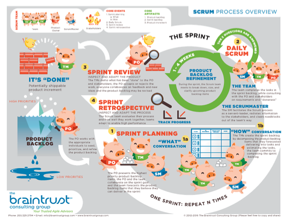

# Scrum

##

[#quantumtalent/coaching](bear://x-callback-url/open-tag?name=quantumtalent/coaching)

[https://github.com/Mature2010/Metodologias-Agiles](https://github.com/Mature2010/Metodologias-Agiles)

**Agil**

* **Ligero**: Las pautas ágiles son tan flexibles que hacen parecer que la metodología es una guía ligera.
* **Pronto**, iteraciones cortas en tiempo (pocas semanas)
* **Expedito**: No tiene estorbos ya que se deshace del desperdicio
* **Adaptable**
* **Iterativo**: Se maneja por ciclos que empiezan y terminan y que toman como input las iteraciones anteriores

**incremental**:Cada iteración entrega más valor.

SCRUM es una metodología flexible (No es extricta se adapta a las necesidades del proyecto).

Aspectos importantes de SCRUM:

* Enfasis en las personas
* Documentación minima (Documentar con proposito)
* Estilo de proceso iterativo (Ciclos cortos con fases definidas)
* Priorizar las actividades que den valor
* Pequeñas y constantes planeaciones.
* Calidad enfocada al cliente
* Auto-organización
* El liderazgo es grupal Colaborativo.
* Retorno de valor temprano.
* Adaptable al cambio.
* Retroalimentación constante
* Ritmo sostenido

**Glosario de la sesión**

**Declaración de la visión del proyecto**: El resultado clave del proceso de creación de la visión del proyecto es una declaración bien estructurada de la declaración de la visión del proyecto.Una buena visión del proyecto explica las necesidades empresariales, así como lo que el proyecto busca cumplir en vez de cómo habrá de satisfacer la necesidad.

La**priorización**puede definirse como la determinación del orden de las cosas y la separación de lo que se hará ahora de lo que se puede hacer después.

Un**sprint**es una iteración con un bloque de tiempo asignado de una a seis semanas de duración durante el cual el equipo Scrum crea y trabaja en los entregables del sprint.

Sprint Backlog: La**lista de pendientes del sprint**es una lista de tareas a ser ejecutadas por el equipo Scrum en el próximo sprint.

**Backlog Priorizado del producto**: Es un documento único de requisitos que define el alcance del proyecto, proporcionando una lista de prioridades de las características del producto o servicio a ser entregado por el proyecto. (Prioritized product Backlog)

Sprint Deliverables: Los**entregables del sprint**son los incrementos del producto o los entregables que se terminan al final de cada sprint.

Accepted Deliverables: Los entregables que cumplen con los criterios de aceptación de las historias de usuario son aceptados por el propietario del producto. Se consideran**entregables aceptados**que pueden distribuirse al cliente si así lo desea.

**Los principios de SCRUM**

* Estos principios no se pueden modificar
* Los principios de SCRUM se pueden aplicar a cualquier tipos de proyecto en cualquier organización
* Se deben de aplicar para garantizar el funcionamiento del framework
* El SCRUM master debe asegurarse que se cumplan los principios de SCRUM
* Son 6 principios de SCRUM
  * Control de proceso empírico
  * Colaboración
  * Auto-organización
  * Time-boxing
  * Desarrollo iterativo
  * Priorización según los valores

**Los Aspectos de SCRUM**

* Es la gestión transversal, los elementos que siempre debemos tener en cuenta. Deben ser abordados y administrados a lo largo del proyecto SCRUM.
* Se pueden llegar a modificar

**Los Procesos de SCRUM:**

* Los elementos que nos van permitir desarrollar SCRUM
* Se pueden llegar a modificar

**Control de proceso empírico**

* En SCRUM, las decisiones se basan en la observación y la experimentación
* El resultado nos da experiencia
* Se basa en el resultado de la retrospectiva
* Resultado de la experiencia es una guía fundamental en SCRUM

**La Auto-Organización**

* Un equipo que se gestiona a sí mismo
* No esperar a ser conducidos por un project manager
* El SCRUM master no gestiona tal cual como un PM
* No significa que permita que un integrante actúe como quiera
* Son equipos maduros, que saben qué hacer, satisfacer al cliente y entregar valor
* No significa anarquia
* Un equipo de SCRUM no está para regalar, sino para generar valor al cliente
* Las metas de un equipo de SCRUM
  * Hacer el trabajo por sí mismo
  * Buscar trabajo proactivamente
  * Estar abierto a nuevos aprendizajes
  * Continuamente actualizar conocimientos y habilidades
  * Entregar resultados tangibles
  * Comprender la visión del proyecto
  * Aprovechar el conocimiento de un equipo multifuncional

**Colaboración**

* El equipo interactúa con los Stakeholders para validar los objetivos del proyecto
* Existen 2 aspectos, buscar siempre estos 2 aspectos en el equipo
  * Cooperación:
    * Unión de fuerzas
  * Colaboración
    * Aprovechar el aporte de alguien para producir algo más grande
* Dimensiones centrales del trabajo colaborativo
  * Conocimiento: Los equipos de SCRUM son muy maduros y capaces
  * Articulación: Dinámica que permite cooperar y colaborar
  * Apropiación: Buscar el bien común del producto que se está haciendo

**SCRUM se basa en 3 ideas principales**

* Transparencia
  * Qué van a hacer
  * Qué estoy haciendo
  * Claro, efectivo y oportuno
  * En qué se esta trabajando
  * Que el cliente sepa qué estamos haciendo
  * Permite que todas las facetas sean observadas por cualquiera
  * Flujo de información fácil
* Adaptación
  * Capacidad dinámica de soportar los cambios
  * Estar dispuesto a aceptar los cambios
  * El negocio es quien conduce la tecnología
  * Permitir entender a los stakeholders
* Insepcción
  * Todo lo que realizamos esta sujeto a verificación
  * Se realiza por parte del product owner

Las**historias de usuario**se apegan a una estructura específica predefinida y son una forma simple de documentar los requerimientos y funcionalidades que desea el usuario final. Los requerimientos expresados en las historias de usuario son oraciones breves, sencillas y fáciles de entender. El formato estándar predefinido da como resultado en una comunicación mejorada entre los stakeholders, así como en mejores estimaciones por parte del equipo.

El**desarrollo iterativo**es la entrega gradual de valor al cliente.

Las**épicas**son historias grandes de usuario, sin refinar en el Backlog Priorizado del Producto.Las épicas se escriben en las etapas iniciales del proyecto, cuando la mayoría de las historias de usuario son funcionalidades de alto nivel o descripciones de productos que están ampliamente definidas.

El**Product Owner**es la persona responsable de maximizar el valor del negocio en el proyecto. Es la persona responsable de articular los requerimientos del cliente y mantener la justificación del negocio del proyecto.

El**Scrum Master**es uno de los roles en el equipo principal de Scrum. Él o ella facilita la creación de entregables del proyecto, gestiona riesgos, cambios e impedimentos durante el proceso de llevar a cabo el Daily Standup, la retrospectiva del sprint y demás procesos de Scrum.

El**Equipo Scrum**es uno de los roles del equipo principal de Scrum. El Equipo Scrum trabaja en la creación de entregables del proyecto y contribuye a la realización del valor del negocio para todos los stakeholders y del proyecto.

**Stakeholder**es un término colectivo que incluye a clientes, usuarios y patrocinadores que interactúan frecuentemente con el Product Owner, con el Scrum Master y con el Equipo Scrum para brindar opiniones y facilitar la creación del producto del proyecto, servicio u otros resultados (Interesado).

El**Scrum Guidance Body**(SGB, por sus siglas en inglés), es un rol opcional que generalmente consiste en un conjunto de documentos y/o un grupo de expertos que normalmente están involucrados en la definición de los objetivos relacionados con la calidad, las regulaciones gubernamentales, la seguridad y otros

Los**vendedores**son individuos externos u organizaciones que ofrecen productos y servicios que no están dentro de las competencias básicas de la organización del proyecto. (proveedores).

Los**criterios mínimos de aceptación**son declarados por la unidad empresarial. Después se convierten en parte de los criterios de aceptación para cualquier historia de usuario para dicha unidad empresarial. Cualquier funcionalidad definida por la unidad empresarial debe satisfacer dichos criterios mínimos de aceptación si busca ser aceptada por el Product Owner.

\*\*Retrospectiva del proyecto:\*\*En este proceso, mismo que concluye el proyecto, los stakeholders y miembros del equipo principal de Scrum se reúnen para hacer una retrospectiva del proyecto e identificar, documentar e internalizar las lecciones aprendidas.A menudo, estas lecciones llevan a la documentación de Agreed Actionable Improvements, que se implementarán en futuros proyectos.

\*\*Demostrar y validar el sprint:\*\*En este proceso, el Equipo Scrum demuestra los entregables del Sprint al Product Owner y a los stakeholders relevantes durante una reunión de revisión del sprint.

\*\*Enviar entregables:\*\*En este proceso, los entregables aceptados se envían o se pasan a los stakeholders pertinentes.Un acuerdo formal de los entregables funcionales documenta la conclusión satisfactoria del sprint.

El**Daily Standup**es una breve reunión diaria con un time-box de 15 minutos. Los miembros del equipo se reúnen para informar sobre cómo avanza el proyecto, respondiendo a las siguientes tres preguntas:¿Qué he hecho desde la última reunión?¿Qué tengo planeado hacer antes de la siguiente reunión?¿Qué impedimentos u obstáculos (si los hubiera) estoy enfrentando en la actualidad?

En SCRUM la calidad se garantiza por el proceso ya que Procesos de alta calidad, dan como resultado un producto de alta calidad.

La retrospectiva nos ayuda a entender el valor y calidad con respecto a experiencias anteriores, sirve para revisar qué hicimos bien para potenciarlo y qué hicimos mal para eliminarlo.

Al tener Verificación constante se encuentran errores y aciertos

Feedback: LAs discusiones constantes entre el equipo y los stakeholders tendrán como resultado asegurar la calidad del producto.

**3. Cambios**Siempre estamos expuestos al cambio y SCRUM acepta el cambio mediante los SPRINTS (basados en feedback) aunque si hacemos un desarrollo rápido se va a bajar la cantidad de ellos.

Al hacer cambios se debe tratar de maximizar los beneficios y disminuir los impactos negativos de los mismos.

Se debe reconocer que:

* Los stakeholders cambian de opinión.
* Es imposible que los stakeholders definan todos los alcances del proyecto al principio del mismo.

Proceso de aprobación de cambios:

1. Solicitud de cambios
2. Se revisa el cambio en las fases de: Desarrollo de épicas, fase de Creación o modificación del backlog.
3. Aprobación de los cambios por parte del Product OwnerDesarrollo

**Fase de Planificación**

**1.** **Crear historias de usuario**—En este proceso, se crean los Las historias de usuario y los Criterios de aceptación de las histiorias del usuario. Los Historias de usuario son generalmente escritas por el Propietario del producto y están diseñadas para asegurar que los requisitos del clienter estén claramente representados y puedan ser plenamente comprendidos por todos los Socios. Los ejercicios de escritura de las historias de usuario se podrán llevar a cabo involucrando a los miembros del Equipo Scrum. Una vez escritas las Historias de Usuario se incorporan en el Prioritized Product Backlog.

**2.** **Aprobar, estimar y asignar historias de usuarios**—En este proceso, el Propietario del producto aprueba las Historias de Usuario para un Sprint. Posteriormente, el Scrum Master y el Equipo de Scrum estiman el esfuerzo necesario para desarrollar la funcionalidad descrita en cada historia de usuario, y el Equipo de Scrum se compromete a entregar los requisitos del cliente en forma de Historias de Usuario.

**3.** **Elaboración de tareas**—En este proceso, las Historias de Usuario aprovadas, estimadas, y asignadas se dividen en tareas específicas y se compilan en una Lista de tareas. A menudo se convoca para tal efecto a un Task Planning Meeting.

**4.** **Estimar tareas**—En este proceso, el Equipo Principal de Scrum durante los Task Estimation Meetings(Reuniones de Estimacion de las Tareas) estima el esfuerzo necesario para realizar cada elemento de la Lista de Tareas. El resultado de este proceso es una Estimación del esfuerzo para la lista de tareas.

**5.** **Elaboración de la lista de pendientes del Sprint**—En este proceso, el Equipo Principal de Scrum lleva a cabo un Sprint Planning Meeting donde el grupo crea un Sprint Backlog que contiene todas las tareas que deben completarse en el Sprint.
